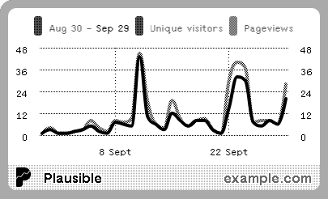
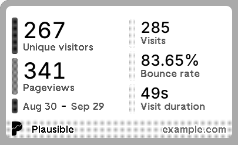

#  trmnl-plausible
Plausible Analytics is a privacy-friendly web analytics platform, available through Plausible.io or via self-hosting the Community Edition. This plugin was developed by Jort van Driel. Feel free to reach out with any questions or issues. (I'm not associated with Plausible Analytics. The logo is copyrighted by them and licensed as CC-BY-SA-4.0.)

## Screenshots
### Show line charts

### Or use bar charts instead

### Give more space to the charts

### Of course quadrants are supported too

